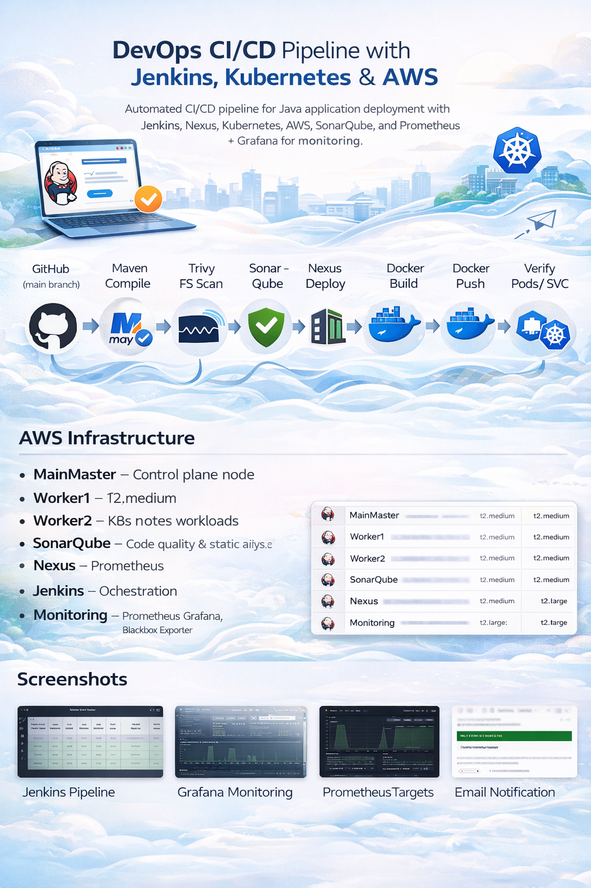
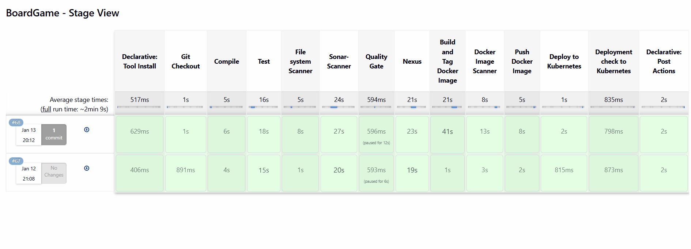
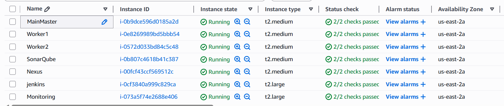
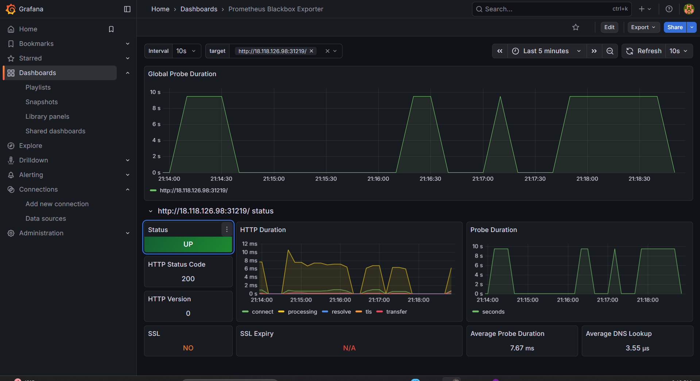
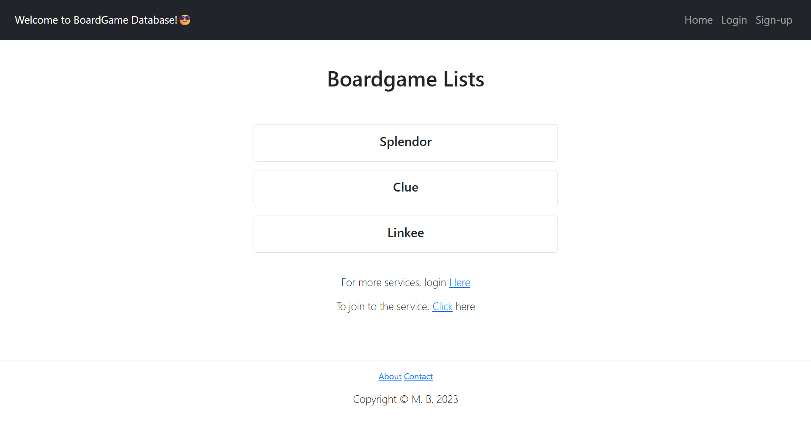
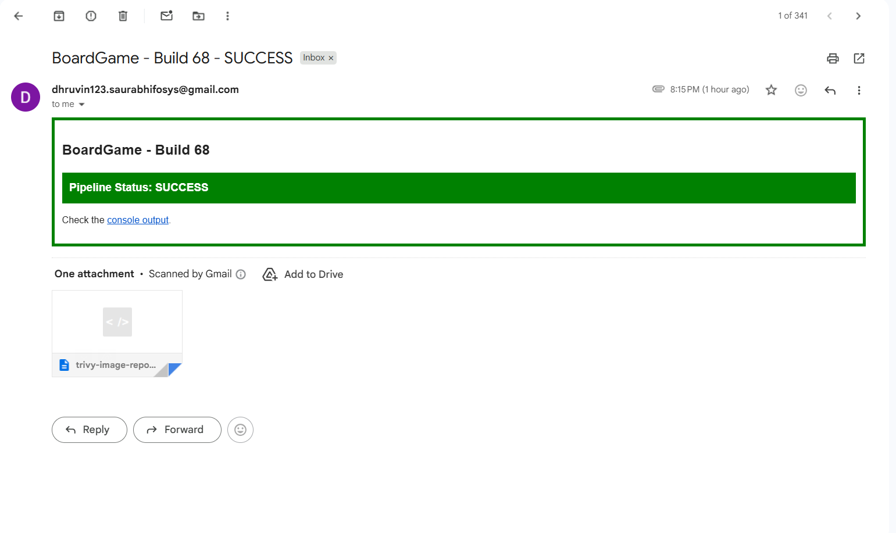

# BoardGame – End-to-End DevOps CI/CD Project

Production-grade CI/CD pipeline for a Java application using Jenkins, Docker, Kubernetes, AWS, and full monitoring with Prometheus & Grafana.

---

## CI/CD Pipeline Overview

### Pipeline Stages
- 🐙 GitHub (main branch)
- ☕ Maven Compile & Test
- 🔍 Trivy File System Scan
- 📊 SonarQube Code Analysis
- 🚦 Quality Gate Enforcement
- 📦 Nexus Artifact Deployment
- 🐳 Docker Build & Tag
- 🛡️ Trivy Image Scan
- 🚀 Docker Hub Push
- ☸️ Kubernetes Deployment
- ✅ Deployment Verification
- 📧 Email Notification with Reports

📄 **Pipeline definition:** [View Jenkinsfile](Jenkinsfile)

---

## Jenkins Pipeline Execution

---

## AWS Infrastructure

### EC2 Instances
- Jenkins (t2.large)
- Kubernetes Cluster: 1 Master + 2 Workers
- SonarQube
- Nexus
- Monitoring (Prometheus + Grafana + Blackbox Exporter)

**Region:** `us-east-2`

---

## Monitoring & Observability

### Grafana – Service Health

### Prometheus Targets

### Blackbox Exporter

---

## Application UI

---

## Notifications

Automated email notification sent after every pipeline execution with Trivy HTML vulnerability report attached.

---

## Security & Quality

- Trivy File System & Docker Image scanning
- SonarQube Quality Gates enforcement
- Artifact versioning and storage via Nexus
- Secrets stored using environment variables
- No credentials committed to the repository
- Role-based access control across services
